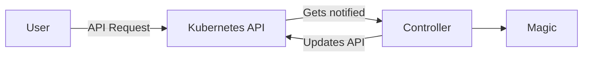
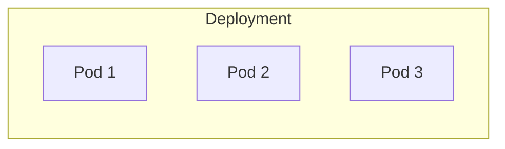
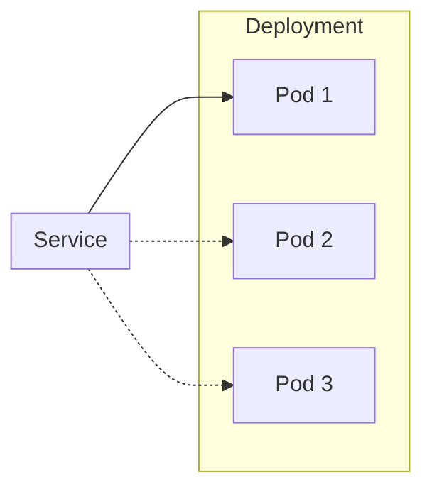
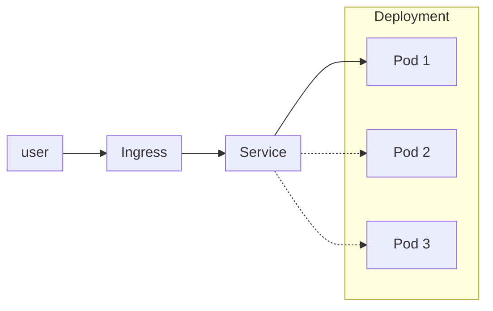

# Basics

This chapter explains basics of Kubernetes. Every section has a theory chapter and establishes knowledge with a small challenge at the end.

Please note that for aktually getting software running in the next chapter, these concepts are good to know, but are not necessarily required to be understood in full detail. So don't worry if not everything is understood in this chapter.

Some parts have a chicken and egg problem. Meaning that they require knowledge from an upcoming chapter. In case something is unclear, please just ask during the workshop.

## yaml

[Yaml](https://en.wikipedia.org/wiki/YAML) is a human readable data serialization language. Sounds more complex than it actually is.

Easy example:

```yaml
singleValue: "This is a single value"
listValues:
  - "this is the first item"
  - "this is the second item"
mapValues:
  myFirstMapValue: "yes. My first map value."
  mySecondMapValue: "oh yes. This is my second map value"
```

More complex example:

```yaml
apiVersion: v1
kind: Pod
metadata:
  name: nginx
spec:
  containers:
  - name: nginx
    image: nginx:1.14.2
    ports:
    - containerPort: 80
```

Creating new yaml files is not required within this workshop. Modifying is relatively easy as the structure is already given.

### challenge - yq

Install the tool called [yq](https://github.com/mikefarah/yq). It is similar to [jq](https://jqlang.github.io/jq/), but for yaml.

1. Save the yaml from above (pod) to a file called `pod.yaml`.
2. Execute the following command on the shell: `yq . pod.yaml`.
3. Alter the command to extract the "image" value (`nginx:1.14.2`). Hint: Use [this quick usage guide](https://github.com/mikefarah/yq?tab=readme-ov-file#quick-usage-guide).

<!-- `yq '.["spec"]["containers"][0]["image"]' pod.yaml` -->

## (Docker) container

A container is an application that is packaged with all the requirements it needs to run. This can be a database, a webserver or any other application. From the perspective of the server where a container is started, the container looks like a normal process.

The benefit comes from the perspective of the process within the container. From this perspective there are different system libraries and files available. This means the server (host system) is invisible from within the container. The biggest benefits come from reducing dependency problems, as well as security improvements.

A container can be built with various tools. The most prominent one is "docker". Other tools are podman or kaniko. For the purpose of this workshop it is not required to build containers.

### challenge - docker build

Please check the setup chapter for instructions to install the Docker Engine (or equivalent) beforehand.

To build a container you may copy and paste the following code into a file and give it the name `Dockerfile`.

!!!Note "Files also in repository"
    Note that you can find all used files in the git repository here: [https://github.com/iptizer/k8s-workshop/tree/main/docs](https://github.com/iptizer/k8s-workshop/tree/main/docs)

```Dockerfile
# Use BusyBox as the base image
FROM busybox

# Create a script that prints "hello"
RUN echo -e "#!/bin/sh \necho hello from the container" > /echo.sh

# Make sure the script is executable
RUN chmod +x /echo.sh

# Execute your script when the container starts
CMD ["/echo.sh"]
```

To build and run the container execute the following commands from the same folder where the `Dockerfile` lies.

```sh
# you may call your docker image myecho or give it some other name
❯ docker build -t myecho .
[+] Building 3.2s (8/8)
[...]
# run the container with "interactive tty & remove after finish" (-it --rm)
❯ docker run -it -rm myecho
hello from the container
```

In case you want to deep dive into the container, [install the tool dive](https://github.com/wagoodman/dive?tab=readme-ov-file#installation) and execute `dive myecho`. Or be crazy and observ the ubtuntu docker image with `dive ubuntu`.

When you have activate the minikube registry (`minikube addons install registry`) it is also possible to push the image to this registry.

Alternatively you can build the docker image directly "inside minikube".

```sh
❯ eval $(minikube -p minikube docker-env)
❯ docker build -t myecho .
```

## Kubernetes API

The most essential concept within Kubernetes is the idea of a Kubernetes API. The Kubernetes API accepts requests. For example "start a container". After that the API (or related software which is called [controller](https://kubernetes.io/docs/concepts/architecture/controller/#controller-pattern)) will make sure that this container is started and keeps running.

In other words: Define target situation via API. The rest is taken care of by Kubernetes. This is referred to as "reconciliation loop".



On our local cluster we can find the API endpoint in our Kubernetes configuration. It is usually placed in `$HOME/.kube/config`. Look into this file. Somewhere we can find the `server: https://127.0.0.1:6443`. This is our API endpoint. Usually this would be a remote IP and NOT a local IP.

### challenge - kubectl proxy

Install the tool `curl`. Curl can be used to send http requests to endpoints.

* Execute `kubectl proxy`. This will start a local endpoint without the need to authenticate.
* In a second terminal execute `curl 127.0.0.1:8001/api/v1/pods`.
* Check [the docs](https://kubernetes.io/docs/concepts/overview/kubernetes-api/) and alter this command to only show all pods of the namespace `kube-system`. (We will clarify what a namespace is later.)
    * Hint: There is no further parameter required. The information lies on a different route.

<!-- `curl http://localhost:8001/api/v1/namespaces/kube-system/pods` -->

### challenge - minikube ssh

1. Use `kubectl get pods -A` to list all containers on the cluster.
2. Use `minikube ssh` to connect on the "server" where our Kubernetes cluster runs. (ctrl + d to exit)
3. Use `docker ps` to list all containers running.
4. Note the difference? Find out the reason.

<!-- A pause container is started by Kubernetes to hold as a placeholder container which holds for example the network namespace. -->

## namespace

Kubernetes has the concept of namespaces. Namespaces are used to separate workloads virtually.

### challenge - create namespace

1. Use the command `kubectl get namespace` to list all namespaces.
2. Observ the output of `kubectl -h` and create your namespace with the name `easterhegg21`.

<!-- `kubectl create namespace easterhegg21` -->

## Pod

A pod is the most essential object within Kubernetes. Most likely it is one container. For example a webserver. After the creation of a pod it cannot be changed. The only way to change the parameters of a pod, is to delete and recreate a pod.

A pod can be seen as the equivalent of a `docker run` command.

### challenge - pod

This challenge will start our first pod within our local Kubernetes cluster. Please note that this pod will be created in the namespace `easterhegg21`.

Copy the following text into a file called `pod.yaml`.

```yaml
apiVersion: v1
kind: Pod
metadata:
  name: webserver
spec:
  containers:
  - name: nginx
    image: nginx
```

Start the webserver with the following command:

```sh
kubectl create -f pod.yaml -n easterhegg21
```

Try to edit your pod. This will fail and is not working.

```sh
kubectl edit pod -n easterhegg21 webserver
```

1. Find out more about your running pod with the command `kubectl describe`.
2. Execute a shell on your webserver container. The command is called `kubectl exec`. Use `-h` with the command to find out more.

<!-- `kubectl describe pod -n easterhegg21 webserver` && `kubectl exec webserver -n easterhegg21 -it -- /bin/bash`. -->

## Deployment

A deployment is a Kubernetes object that wraps a pod. A deployment can be modified. When a pod difinition is altered, Kubernetes will stop your old pod and will start a new one. This process can for example be used for updates of the software running. In addition to this update procedure, a deployment can also start multiple pods with the same parameters.



Copy and paster the following lines into a file called `deployment.yaml`.

```yaml
apiVersion: apps/v1
kind: Deployment
metadata:
  name: webserver-deployment
spec:
  replicas: 1  # Specifies the number of replicas (pod instances) you want
  selector:
    matchLabels:
      app: webserver  # This should match the labels of your pod template
  template:
    metadata:
      labels:
        app: webserver  # Label your pod template to match the selector
    spec:
      containers:
      - name: nginx
        image: nginx
```

To apply, execute a `kubectl apply -f deployment.yaml -n easterhegg21`.

Observe the names of the pods with a `kubectl get pods -n easterhegg21`.

### challenge - deployment

Observe the `kubectl scale -h` command and change your webserver deployment to 3. Before scaling open a new shell and use the command `kubctl get pods -n easterhegg21 -w` to check what is happening.

<!-- See here how to scale [https://kubernetes.io/docs/concepts/workloads/controllers/deployment/#scaling-a-deployment](https://kubernetes.io/docs/concepts/workloads/controllers/deployment/#scaling-a-deployment) -->

Change the deployment so, that every pod of your webserver requests 10 milli CPUs (`10m`). See [this example](https://kubernetes.io/docs/concepts/configuration/manage-resources-containers/#example-1) for a pod. Note that a deployment wraps a pod definition under "teamplate".

## Service

With a pod and a deployment we now have a webserver running. But the webserver is not reachable from the outside, nor is it reachable from within the cluster. To make services available, another Kubernetes object is introduces. With a service object the database connection or the webserver address can be made available within the cluster.

A service object assigns a special address (IP) within the cluster. This address is not changing, and therefore independant from the workload it is pointing to.



Copy the following yaml into a file called `deployment_service.yaml` and apply with `kubectl apply -f deployment_service.yaml -n easterhegg21`.

```yaml
apiVersion: apps/v1
kind: Deployment
metadata:
  name: webserver-deployment
spec:
  replicas: 1
  selector:
    matchLabels:
      app: webserver
  template:
    metadata:
      labels:
        app: webserver
    spec:
      containers:
      - name: nginx
        image: nginx
        ports:
        - containerPort: 80  # Specifies the port the container exposes
---
apiVersion: v1
kind: Service
metadata:
  name: webserver-service
spec:
  selector:
    app: webserver  # Matches the label of the Deployment's Pods
  ports:
    - protocol: TCP
      port: 80  # The port the service is exposed on.
      targetPort: 80  # The target port on the Pod containers.
```

It is possible to use `kubectl` to directly forward a local port to the pod or the service port. Connect to a pod directly using the following command:

```sh
# find the pod name
❯ k get po -n easterhegg21
NAME                                    READY   STATUS    RESTARTS   AGE
webserver-deployment-5d5c5c44c7-x9x9d   1/1     Running   0          69m
# forward remote port 80 to local port 8080
❯ k port-forward -n easterhegg21 po/webserver-deployment-5d5c5c44c7-x9x9d 8080:80
Forwarding from 127.0.0.1:8080 -> 80
Forwarding from [::1]:8080 -> 80
Handling connection for 8080
```

While being connected restart your deployment with the following command: `kubectl rollout restart deployment -n easterhegg21 webserver-deployment`. Watch what happens with `kubectl get po -n easterhegg21 -w`, while still having the port forward active.

Check the difference with connecting directly to the service with the `kubectl port-forward` command.

### challenge - service

There are actually multiple different kind of services. Check [the docs](https://kubernetes.io/docs/concepts/services-networking/service/#publishing-services-service-types) for the differences and convert your service to type `NodePort`.

<!-- kubectl patch svc webserver-service -p '{"spec":{"type":"NodePort"}}' -n easterhegg21 -->

## nip.io

Many services require a domain name system record (DNS). A DNS entry is a mapping from a human readable text to an IP (constraints apply). For example [https://heise.de](https://heise.de). This creates problems for development setups where the IP is most of the time `127.0.0.1`.

To work around this issue a service like [https://nip.io](https://nip.io) exists. This service provides domain addreses that can point to `127.0.0.1`. We can for examle use: `easterhegg21-127-0-0-1.nip.io`.

```sh
# should resolve to 127.0.0.1
# if not => try to reconfigure your dns server
nslookup easterhegg21.127.0.0.1.nip.io
nslookup easterhegg21-127-0-0-1.nip.io
# you may use a tool called "dig" to query other name servers
# "sudo yum install bind-utils" || "sudo apt-get install dnsutils"
dig easterhegg21-127-0-0-1.nip.io @8.8.8.8
```

### challenge - hex notation

[nip.io](https://nip.io) has another way to write the hostname. Construct the hostname in hex notation.

<!--  7f000001.nip.io -->

## Ingress

Within our cluster there is now a webserver running and we can access it from the inside of the cluster. To expose a web service outside the cluster, another Kubernetes object in intruduced: Ingress

Ingress is a so called reverse proxy that can handle more advanced use-cases related to web traffic handling. This includes for example the handling of certificates (TLS termination).



So expose the deployment and the service from above to outside the cluster, use the following lines and paste them into a file called `deployment_service_ingress.yaml`. Ingress addon is reuqired here. See setup chapter.

```yaml
apiVersion: apps/v1
kind: Deployment
metadata:
  name: webserver-deployment
spec:
  replicas: 1
  selector:
    matchLabels:
      app: webserver
  template:
    metadata:
      labels:
        app: webserver
    spec:
      containers:
      - name: nginx
        image: nginx
        ports:
        - containerPort: 80  # Specifies the port the container exposes
---
apiVersion: v1
kind: Service
metadata:
  name: webserver-service
spec:
  selector:
    app: webserver  # Matches the label of the Deployment's Pods
  ports:
    - protocol: TCP
      port: 80  # The port the service is exposed on.
      targetPort: 80  # The target port on the Pod containers.
---
apiVersion: networking.k8s.io/v1
kind: Ingress
metadata:
  name: webserver-ingress
spec:
  rules:
  - host: webserver-127-0-0-1.nip.io
    http:
      paths:
      - path: /
        pathType: Prefix
        backend:
          service:
            name: webserver-service
            port:
              number: 80
```

Use the command `minikube tunnel` to start a tunnel to the Kubernetes cluster. This requires root rights and will host the ingress on port 80 and 443. After that you may head over to the browser and surv to your hosted nginx: [https://webserver-127-0-0-1.nip.io](https://webserver-127-0-0-1.nip.io).

### challenge - nginx

Use the `kubectl exec` command to get a shell on your pod and modify the "Welcome to nginx!" headline to "Welcome to Easterhegg21!". On the pod the html file lies in `/usr/share/nginx/html`. As no editor is installed the tool sed may be used with the command: `sed -i "s/Welcome to nginx/Welcome to Easterhegg21/" /usr/share/nginx/html/index.html`.

Refresh the web page to validate your modification. Use the `kubectl restart rollout` command from above and relead the page again.

<!-- find the pod name `kubectl get pods -n easterhegg21`. Exec to the pod `kubectl exec`. -->

## More basic concepts

This chapter focused on the essentials of Kubernetes. There are a couple of other basic concepts that are not so relevant for now. Check the list below to learn more in case you have time.

* A deployment abstracts pods. There are two other common objects for other use cases. [DaemonSets](https://kubernetes.io/docs/concepts/workloads/controllers/daemonset/) and [StatefulSets](https://kubernetes.io/docs/concepts/workloads/controllers/statefulset/).
* Kubernetes has the abiltiy to decouple configuration from workloads. [ConfigMaps](https://kubernetes.io/docs/concepts/configuration/configmap/) and [Secrets](https://kubernetes.io/docs/concepts/configuration/secret/) are used for this.
* For now only statelass applications are covered. To imlement persistancy volumes can be used. One concept here is called [Persistant Volume Claim (PVC)](https://kubernetes.io/docs/concepts/storage/persistent-volumes/#reserving-a-persistentvolume).
