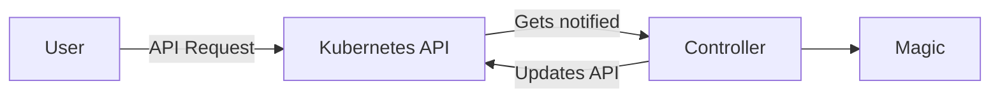
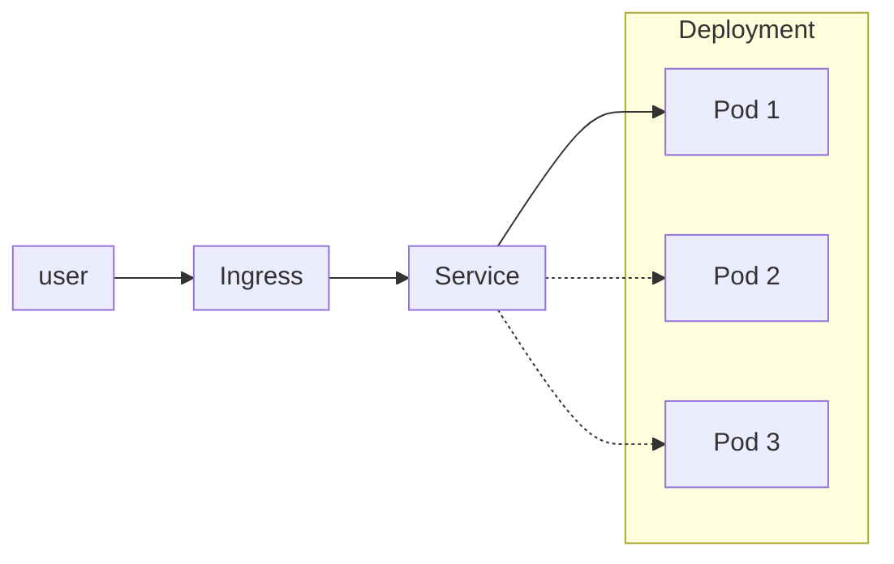

# Basics

This chapter explains basics of Kubernetes. Every section has a theory chapter and establishes knowledge with a small challenge at the end.

Some parts have a chicken and egg problem. Meaning that they require knowledge from a previous chapter. In case something is unclear, please ask during the workshop.

## yaml

[Yaml](https://en.wikipedia.org/wiki/YAML) is a human readable data serialization language. Sounds more complex than it actually is.

Easy example:

```yaml
singleValue: "This is a single value"
listValues:
  - "this is the first item"
  - "this is the second item"
mapValues:
  myFirstMapValue: "yes. My first map value."
  mySecondMapValue: "oh yes. This is my second map value"
```

More complex example:

```yaml
apiVersion: v1
kind: Pod
metadata:
  name: nginx
spec:
  containers:
  - name: nginx
    image: nginx:1.14.2
    ports:
    - containerPort: 80
```

Creating new yaml files is not required within this workshop. Modifying is relatively easy as the structure is already given.

### challenge - yq

Install the tool called [yq](https://github.com/mikefarah/yq). It is similar to [jq](https://jqlang.github.io/jq/), but for yaml.

1. Save the yaml from above (pod) to a file called `pod.yaml`.
2. Execute the following command on the shell: `yq . pod.yaml`.
3. Alter the command to extract the "image" value (`nginx:1.14.2`).

[solution]: <> `yq '.["spec"]["containers"][0]["image"]' pod.yaml`

## (Docker) container

A container is an application that is packaged with all the requirements it needs to run. This can be a database, a webserver or any other application. From the perspective of the server where a container is started, the container looks like a normal process.

The benefit comes from the perspective of the process within the container. From this perspective there are different system libraries and files available. This means the server (host system) is invisible from within the container. The biggest benefits come from reducing dependency problems, as well as security improvements.

A container can be built with various tools. The most prominent one is "docker". Other tools are podman or kaniko. For the purpose of this workshop it is not required to build containers.

### challenge - docker build

Please check the setup chapter for instructions to install the Docker Engine beforehand.

To build a container you may copy and paste the following code into a file and give it the name `Dockerfile`.

```Dockerfile
# Use BusyBox as the base image
FROM busybox

# Create a script that prints "hello"
RUN echo -e "#!/bin/sh \necho hello from the container" > /echo.sh

# Make sure the script is executable
RUN chmod +x /echo.sh

# Execute your script when the container starts
CMD ["/echo.sh"]
```

To build and run the container execute the following commands from the same folder where the `Dockerfile` lies.

```sh
# you may call your docker image myecho or give it some other name
❯ docker build -t myecho .
[+] Building 3.2s (8/8) 
[...]
# run the container with "interactive tty & remove after finish" (-it --rm)
❯ docker run -it -rm myecho
hello from the container
```

## Kubernetes API

The most essential concept within Kubernetes is the idea of an API. This API accepts requests. For example "start a container". After that the API (or related software which is called [controller](https://kubernetes.io/docs/concepts/architecture/controller/#controller-pattern)) will make sure that this container is started and keeps running.

In other words: Define target situation via API. The rest taken care of by Kubernetes. This is referred to as "reconciliation loop".



On our local cluster we can find the API endpoint in our Kubernetes configuration. It is usually placed in `$HOME/.kube/config`. Look into this file. Somewhere we can find the `server: https://127.0.0.1:6443`. This is our API endpoint. Usually this would be a remote IP and NOT a local IP.

### challenge - kubectl proxy

Install the tool `curl`. Curl can be used to send http requests to endpoints.

* Execute `kubectl proxy`. This will start a local endpoint without the need to authenticate.
* In a second terminal execute `curl 127.0.0.1:8001/api/v1/pods`.
* Check [the docs](https://kubernetes.io/docs/concepts/overview/kubernetes-api/) and alter this command to only show all pods of the namespace `kube-system`. (We will clarify what a namespace is later.)
    * Hint: There is no further parameter required. The information lies on a different route.

[solution]: <> `curl http://localhost:8001/api/v1/namespaces/kube-system/pods`

## Container

A container (Docker container) is a normal Linux process (from the perspective of a server). Meaning: On a server that runs a postgres database container, the database process can be seen.

The trick lies in the view of the process. The process is isolated from the server it runs on.

The benefit of a container comes from the fact, that it is shipped including all required libraries. It also decouples "application data" and "peresistent data". This solves a lot of issues, for example "dependendency problems" and "application update process".

### challenge - minikube ssh

1. Use `kubectl get pods -A` to list all containers on the cluster.
2. Use `minikube ssh` to connect on the "server" where our Kubernetes cluster runs. (ctrl + d to exit)
3. Use `docker ps` to list all containers running.
4. Note the difference? Find out the reason.

[solution]: <> A pause container is started by Kubernetes to hold as a placeholder container which holds for example the network namespace.

## namespace

Kubernetes has the concept of namespaces. Namespaces are used to separate workloads virtually.

### challenge - create namespace

1. Use the command `kubectl get namespace` to list all namespaces.
2. Observ the output of `kubectl -h` and create your namespace with the name `easterhegg21`.

[solution]: <> `kubectl create namespace easterhegg21`

## Pod

A pod is the most essential object within Kubernetes. Most likely it is one container. For example a webserver. After the creation of a pod it cannot be changed. The only way to change the parameters of a pod, is to delete and recreate a pod.

A pod can be seen as the equivalent of a `docker run` command.

### challenge - pod

This challenge will start our first pod within our local Kubernetes cluster. Please note that this pod will be created in the namespace `easterhegg21`.

Copy the following text into a file called `pod.yaml`.

```yaml
apiVersion: v1
kind: Pod
metadata:
  name: webserver
spec:
  containers:
  - name: nginx
    image: nginx
```

Start the webserver with the following command:

```sh
kubectl create -f pod.yaml
```

Find out more about your running pod with the command `kubectl describe`.

[solution]: <> `kubectl describe pod -n easterhegg21 webserver`

## Deployment

## Service

## nip.io

Many services require a domain name system record (DNS). A DNS entry is a mapping from a human readable text to an IP (constraints apply). For example [https://heise.de](https://heise.de). This creates problems for development setups where the IP is most of the time `127.0.0.1`.

To work around this issue a service like [https://nip.io](https://nip.io) exists. This service provides domain addreses that can point to `127.0.0.1`. We can for examle use: `easterhegg21-127-0-0-1.nip.io`.

```sh
# should resolve to 127.0.0.1
# if not => try to reconfigure your dns server
nslookup easterhegg21.127.0.0.1.nip.io
nslookup easterhegg21-127-0-0-1.nip.io
# you may use a tool called "dig" to query other name servers
# "sudo yum install bind-utils" || "sudo apt-get install dnsutils"
dig easterhegg21-127-0-0-1.nip.io @8.8.8.8
```

### [BONUS CHALLENGE] hex notation

nip.io has another way to write the hostname. Construct the hostname in hex notation.

## Ingress


