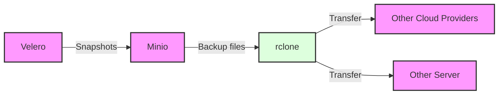

# Backup

Having backups for home servers is extremely important as you may run your mail setup which could mean loowing a lot of valueable information.

!!!Note "Not completely implemented"
    Currently this tutorial does not completely show all the steps in full detail.

## Idea

The proposed backup concept works as follows:

1. Create backups with the tool [Velero](https://velero.io/docs/v1.9/how-velero-works/).
2. Velero has the option to send the backups to S3. S3 can be deployed with the open source tool [MinIO](https://min.io/).
3. From Minio the backups can be transferred to anywhere in the world. For example using [rclone](https://rclone.org/docs/) and a [Kubernetes cron job](https://kubernetes.io/docs/concepts/workloads/controllers/cron-jobs/).



## Velero

**TODO**

## Minio

Minio is a s3 compatible open source implementation. It can be deployed on a Kubernetes cluster with copy and pasting the following into a file called `helm_minio.yaml`.

```yaml
mode: standalone

rootUser: "root"
rootPassword: "rootpwrootpw"

buckets:
  - name: easterhegg21
    policy: none
    purge: false
    versioning: false 
    objectlocking: false

persistence:
  enabled: true
  size: 5Gi

service:
  type: ClusterIP
  port: "9000"

consoleService:
  type: ClusterIP
  port: "9001"

securityContext:
  enabled: true
  runAsUser: 1000
  runAsGroup: 1000
  fsGroup: 1000

resources:
  requests:
    memory: 1Gi

ingress:
  enabled: true
  ingressClassName: ~
  labels: {}
  annotations:
    cert-manager.io/cluster-issuer: "selfsigned-issuer"
  path: /
  hosts:
    - minio-127-0-0-1.nip.io
  tls:
   - secretName: minio-127-0-0-1-nip-io
     hosts:
       - minio-127-0-0-1.nip.io

consoleIngress:
  enabled: true
  ingressClassName: ~
  labels: {}
  annotations:
    cert-manager.io/cluster-issuer: "selfsigned-issuer"
  path: /
  hosts:
    - minio-console-127-0-0-1.nip.io
  tls:
   - secretName: minio-console-127-0-0-1-nip-io
     hosts:
       - minio-console-127-0-0-1.nip.io
```

Apply with the following lines:

```sh
helm repo add minio https://charts.min.io/
helm repo update
# 11.02.2024: Removed and reinstalled due to upgrade problem
helm upgrade --install -f helm_minio.yaml --namespace minio --create-namespace minio minio/minio
```

### Play

You can access the minio console under [https://minio-console-127-0-0-1.nip.io/minio/](https://minio-console-127-0-0-1.nip.io/minio/). A default bucket with the name `easterhegg21` is already created. For username and password see the helm chart.

You may list all files with the configurations and commands as below using the [aws cli](https://docs.aws.amazon.com/cli/latest/userguide/getting-started-install.html#getting-started-install-instructions).

As an alternative the minio cli `mc` can be [installed](https://min.io/docs/minio/linux/reference/minio-mc.html#quickstart) and used. Note that the helm chart output requires the endpoints to be updated.

```sh
export AWS_ACCESS_KEY_ID=root
export AWS_SECRET_ACCESS_KEY=rootpwrootpw
export AWS_S3_ENDPOINT=https://minio-127-0-0-1-nip-io
export AWS_REGION=us-east-1
# list files
aws s3 ls s3://easterhegg21 --endpoint-url https://minio-127-0-0-1.nip.io --no-verify-ssl
# of course nothing found. Create demo file and upload file.
echo "BLUB" > blub.txt
aws s3 cp ./blub.txt s3://easterhegg21/ --endpoint-url https://minio-127-0-0-1.nip.io --no-verify-ssl
# now the ls will show the file, see also the web console
aws s3 ls s3://easterhegg21 --endpoint-url https://minio-127-0-0-1.nip.io --no-verify-ssl
```