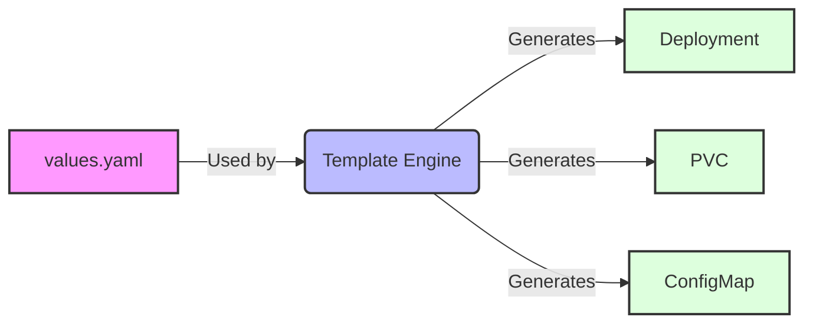

# Explore

Within the last chapter basic concepts have been demonstrated and a local development environment has been set up. This chapter will introduce new concepts, new software, and explorative examples that can be deployed easily in Kubernetes.

The idea is, that all apps can be tried out in the local setup. But also be used as a starting point for a potential production setup as introduced in the last chapter. There are two exceptions, ingress and OpenEBS. Those are only explained for the remote server, as the functionality comes right out-of-the-box with minikube. MailU can be installed on the local setup, but not really used, as a mail setup required a real server with internet connectivity.

All used files can be found in the directory [`/files` within this repository](https://github.com/iptizer/k8s-workshop/tree/main/files).

* `OpenEBS` to provide Kubernetes volumes.
* `ingress-nginx` to provide ingress functionality.
* `Cert-manager` for certificates.
* `Gitea` as a git server.

* `Wordpress` as a common example.
* `Velero` as a backup tool.
* `Minio` as a storage solution.
* `Prometheus-stack` as a feature rich monitoring solution.
* `Nextcloud` as a feature rich collaboration solution.
* `MailU` as a mail environment.
* Phpmyadmin and postgresql databases as a common example.
* `Appsmith` as a fancy try-out example.
* `nocodb` as another fancy example.

## helm

To deploy all these packages [the tool helm](https://helm.sh/docs/intro/quickstart/) is used. Helm is called "the package manager of Kubernetes". It works with a `values.yaml` file, which is used to template Kubernetes resources (other yamls).



## Dashboard

As part of minikube a Kubernetes dashboard can be accessed. The main purpose is to visualize current workloads. The dashboard can be installed and accessed with the following command. After the dashboard is up and running, the browser will be opened automatically.

```sh
minikube dashboard
```
