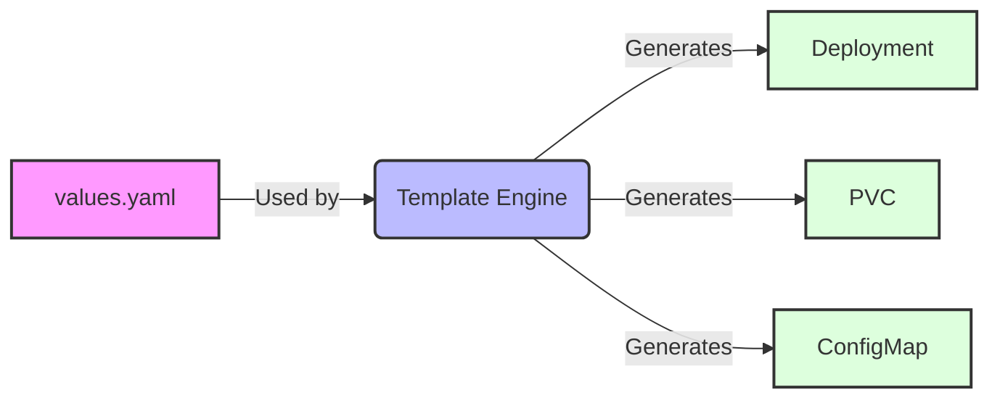

# Explore

Within the last chapter basic concepts have been demonstrated and a local development environment has been set up. This chapter will introduce new concepts, new software, and explorative examples that can be deployed easily in Kubernetes.

The idea is, that all apps can be tried out in the local setup. But also be used as a starting point for a potential production setup as introduced in the last chapter. There are two exceptions, ingress and OpenEBS. Those are not explained for the local setup as the functionality comes right out-of-the-box with minikube.

* Volumes with OpenEBS.
* Wordpress as a common example.
* Cert-manager for certificates.
* Velero as a backup tool.
* Minio as a storage solution.
* Monitoring with Prometheus.
* Gitea as a git server.
* Nextcloud.
* MailU as a mail environment.
* Phpmyadmin and postgresql databases as a common example.
* Appsmith as a fancy try-out example.

## helm

To deploy all these packages [the tool helm](https://helm.sh/docs/intro/quickstart/) is used. Helm is called "the package manager of Kubernetes". It works with a `values.yaml` file, which is used to template Kubernetes resources (other yamls).

